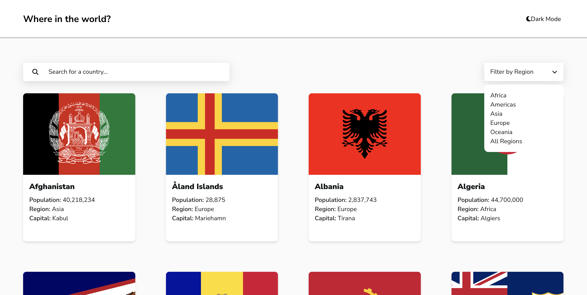
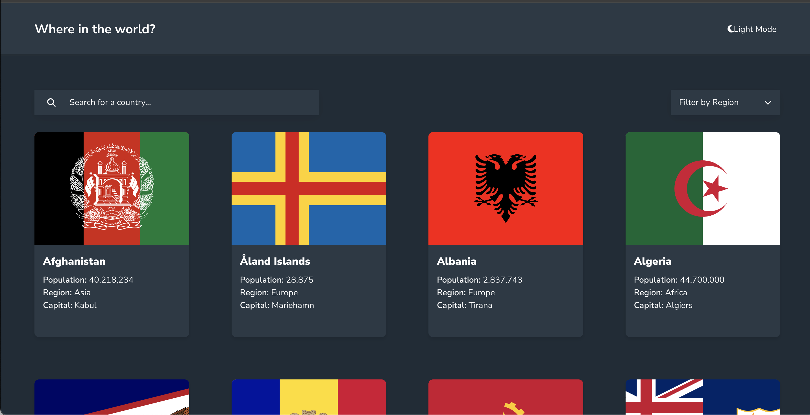
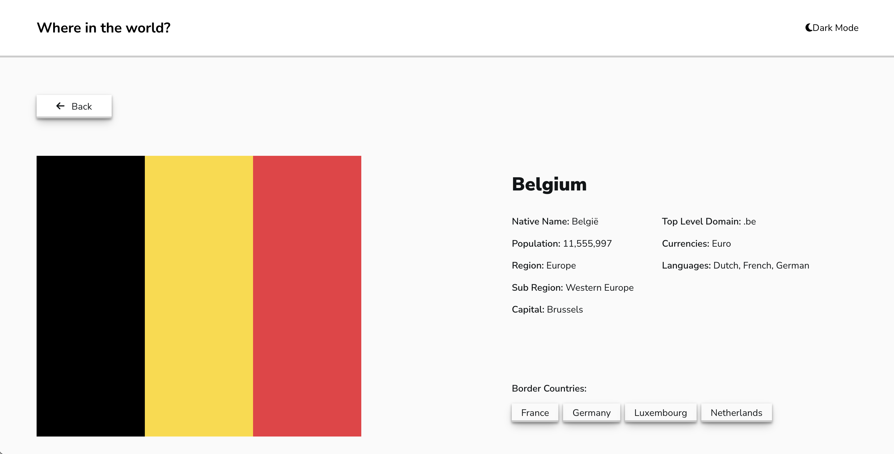

# Where in the World

**Where in the World** is a React-based web application that allows users to browse and explore detailed information about different countries. The app provides search and filtering functionalities, displays country details, and features a **dark/light mode toggle** for better user experience.

---

## Overview

The **Where in the World** application allows users to:

- Browse a list of **countries** with key information such as population, region, and capital.
- **Search for a country** by name.
- **Filter countries by region** (e.g., Europe, Asia, Africa).
- Click on a **country for detailed information**, including language, currency, and neighboring countries.
- **Navigate through border countries** seamlessly.
- **Toggle between dark and light modes** for improved UI accessibility.

---

## Features

**Real-time country search** using an input field.
**Region-based filtering** to narrow down results.
**Detailed country view** with extended information.
**Border country navigation** for easy exploration.
**Dark mode / Light mode toggle** for a customizable experience.
**Responsive design** for browsing on all devices.

---

## Technologies Used

- **React.js** - Frontend framework
- **React Router** - For dynamic routing
- **Context API** - State management for theme and filters
- **CSS Grid & Flexbox** - For layout and styling
- **REST Countries API** - Provides country data
- **FontAwesome** - Used for UI icons

---

## Installation & Setup

### **Clone the Repository**

```sh
git clone https://github.com/Wilmer856/where-in-the-world.git
cd where-in-the-world
npm install
npm run dev

```

Then, open http://localhost:5173/ in your browser

## Screenshots






